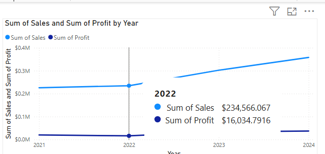
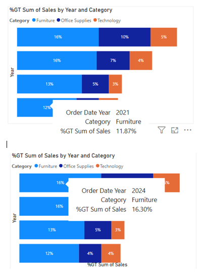
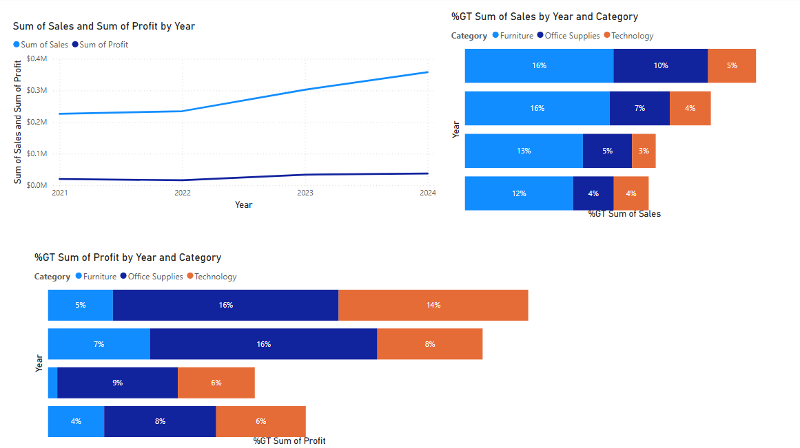

# Sales & Profit Analysis Overview  

This project explores **sales and profit trends** across categories and years, using Power BI dashboards to uncover insights into growth patterns, category contributions, and profitability.  

The analysis demonstrates how raw data can be **cleaned, transformed, and visualized** to support business decision-making.  

##  Key Visuals & Findings  

###  Sales & Profit by Year 

**Viz:** Line Chart  

**How have overall sales and profit trends evolved year-over-year, and what does this indicate about business growth between 2021 and 2024?**

**Analysis** (2021 → 2024):**
- **2021:** Sales **$225,942** | Profit **$19,987**
- **2022:** Sales **$234,566** | Profit **$16,035**  *(profit dip)*
- **2023:** Sales **$302,278** | Profit **$33,690**
- **2024:** Sales **$357,821** | Profit **$37,225**  *(peak)*

**Interpretation:**  
Sales grew steadily from **$226K → $358K** over four years. Profit **fell in 2022** (likely higher costs/discounts) but **rebounded strongly** in 2023 and reached a **new high in 2024**. This pattern suggests margin pressure in 2022 followed by improved pricing/cost control in later years.
 

##  % of Sales by Category (Yearly)

**Viz:** Stacked Bar Chart 

**How did the sales contribution of each category (Furniture, Office Supplies, Technology) change between 2021 and 2024?**

**Analysis**
- **Furniture:** Increased its sales share from **11.9% in 2021** to **16.3% in 2024**, showing stronger positioning in the market.  
- **Office Supplies:** Declined slightly from **10% in 2021** to **7% in 2024**, indicating reduced contribution to overall sales.  
- **Technology:** Dropped from **5% in 2021** to **4% in 2024**, suggesting stagnation compared to Furniture’s upward trend.  

**Insight:**
Over the four years, **Furniture emerged as the key growth driver in sales share**, while **Office Supplies and Technology lost ground**, signaling potential need for strategy adjustments in those categories.

### Profit by Year & Category  

**Viz:** Stacked Bar Chart 

**Analysis**

- **Technology** contributed the most profit growth (up to 14%).  
- **Office Supplies** maintained steady profit shares (8–16%).  
- **Furniture** lagged behind in profitability.  

**Insight**

Technology led profit growth (up to 14%), Office Supplies stayed steady (8–16%), while Furniture lagged—signaling a need for strategic review.

## Sales & Profit Analysis Overview 

**How have overall sales and profits grown year by year, and which product categories contributed the most to sales and profit percentages over time?**

**Viz:** Line Chart + Stacked Bar Charts

  

**Analysis**
- **Sales** grew steadily from **$225K in 2021** to **$358K in 2024**, while **profit** also rose from **$20K** to **$37K**.  
- **Furniture** consistently contributed the largest share of sales (12–16%), with growth in both sales and profit.  
- **Office Supplies** showed stable profit share (~16%) but declining sales share (from 10% to 4%).  
- **Technology** maintained modest sales share (3–5%) but contributed **up to 14% of profit**, showing higher margins despite lower sales volume.  

**Insight:** Overall growth is positive, but **Furniture drives sales volume**, while **Technology delivers strong profitability relative to sales**.

### Scatterplot: Sales vs Profit 

**Viz:** Scatterplot  

**What is the relationship between sales and profit for the Furniture category?**

 

**Analysis**
- Each dot represents a sales transaction for **Furniture**.  
- Most points cluster close to **low sales & low profit**, but higher sales transactions also show profit variability.  
- The upward trendline indicates that **higher sales generally drive higher profit**, though some outliers show **losses even with high sales** (likely due to heavy discounts or high costs).  

## Overall Insights  
- **Technology** is the highest profit driver despite lower sales → high-margin category.  
- **Furniture** has high sales but low profit → requires cost and pricing review.  
- **Office Supplies** remain stable and consistent in profitability.  

##  Dashboard Access  
[Click here to view the live dashboard](https://app.powerbi.com/links/Qi3WJLvuxj?ctid=51aa8f26-2e23-4b8c-bca8-7cc441adc4df&pbi_source=linkShare)  
