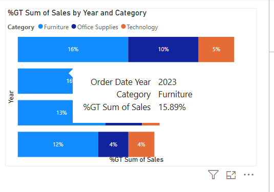

Superstore-sales-and-profit-analysis
Superstore Sales &amp; Profit Analysis with Power BI — dashboards showing year-over-year trends, category performance, and profit margins.
## 🔗 Interactive Power BI Dashboard
[Click here to view the live dashboard](https://app.powerbi.com/links/Qi3WJLvuxj?ctid=51aa8f26-2e23-4b8c-bca8-7cc441adc4df&pbi_source=linkShare)
# 📊 Sales & Profit Analysis Overview  

This project explores **sales and profit trends** across categories and years, using Power BI dashboards to uncover insights into growth patterns, category contributions, and profitability.  

The analysis demonstrates how raw data can be **cleaned, transformed, and visualized** to support business decision-making.  

---

## ⚙️ Tools & Techniques Used  
- **Power BI** for data transformation, modeling, and visualization  
- **Area Charts** to display quarterly and yearly profit growth  
- **Bar/Column Charts** to analyze category contributions and discount impacts  
- **Map Visuals** for geographic profit insights  

---

##  Key Visuals & Findings  

### 1. Sales & Profit by Year  
**Visualization Used:** Line Chart  

**What it shows (2021 → 2024):**
- **2021:** Sales **$225,942** | Profit **$19,987**
- **2022:** Sales **$234,566** | Profit **$16,035**  *(profit dip)*
- **2023:** Sales **$302,278** | Profit **$33,690**
- **2024:** Sales **$357,821** | Profit **$37,225**  *(peak)*

**Interpretation:**  
Sales grew steadily from **$226K → $358K** over four years. Profit **fell in 2022** (likely higher costs/discounts) but **rebounded strongly** in 2023 and reached a **new high in 2024**. This pattern suggests margin pressure in 2022 followed by improved pricing/cost control in later years.
 

### 2. Sales by Category (% Contribution)  
**Visualization Used:** Stacked Bar Chart  
- **Furniture** drove strong sales (12–16%), but with weaker profitability.  
- **Technology** had smaller sales shares but higher margins.  

  

---

### 3. Profit by Year & Category  
**Visualization Used:** Stacked Bar Chart  
- **Technology** contributed the most profit growth (up to 14%).  
- **Office Supplies** maintained steady profit shares (8–16%).  
- **Furniture** lagged behind in profitability.  

---

### 4. Sales & Profit Analysis Overview  
**Visualization Used:**   
- Comprehensive view of **sales and profit growth**, category-level contributions, and overall profitability trends.  

  

### 5. Scatterplot: Sales vs Profit  
**Visualization Used:** Scatterplot  
- Each dot represents a sales transaction for **Furniture**.  
- Most points cluster close to **low sales & low profit**, but higher sales transactions also show profit variability.  
- The upward trendline indicates that **higher sales generally drive higher profit**, though some outliers show **losses even with high sales** (likely due to heavy discounts or high costs).  

## 🔑 Overall Insights  
- **Technology** is the highest profit driver despite lower sales → high-margin category.  
- **Furniture** has high sales but low profit → requires cost and pricing review.  
- **Office Supplies** remain stable and consistent in profitability.  
- Profitability is influenced heavily by discounting and category pricing strategies.  

---

## 🔗 Dashboard Access  
[Click here to view the live dashboard](https://app.powerbi.com/links/Qi3WJLvuxj?ctid=51aa8f26-2e23-4b8c-bca8-7cc441adc4df&pbi_source=linkShare)  
